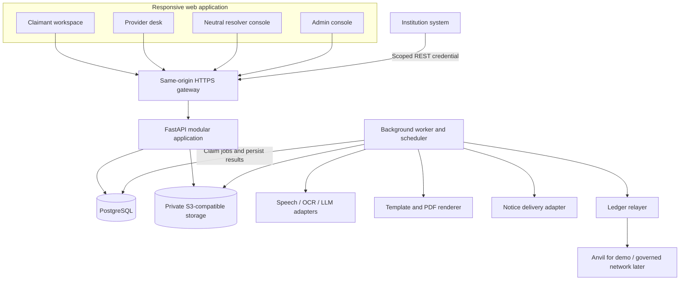
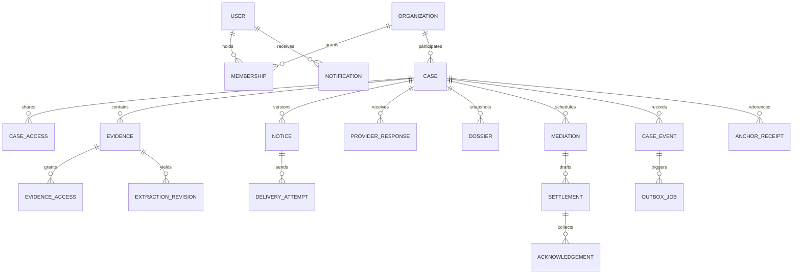
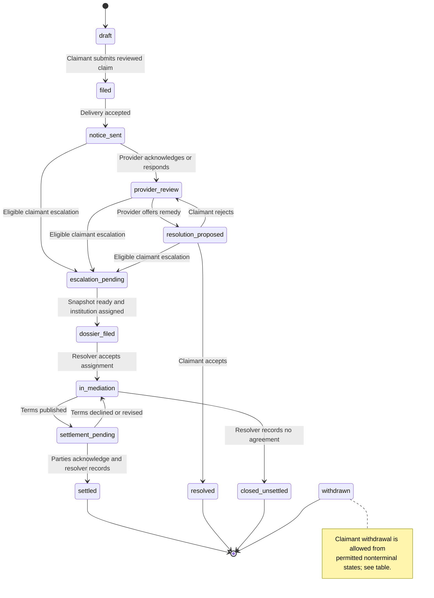
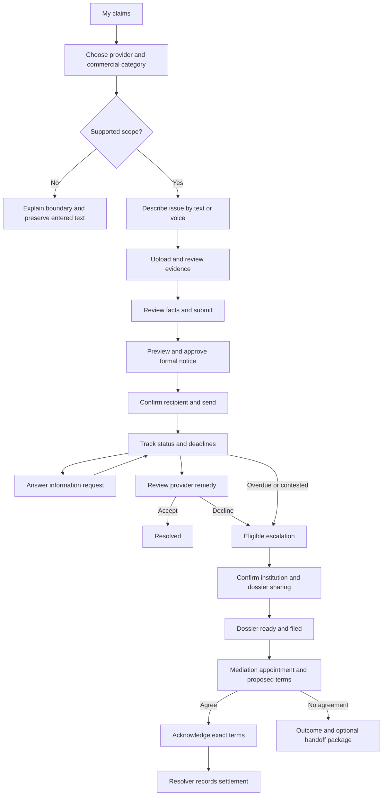

# Sulha — Technical Product Requirements Document

**Version:** 2.0 · **Date:** 12 September 2026  
**Product:** MSME claims and dispute management for commercial service-provider disputes  
**Context:** Hack4Justice 2026, Challenge B · 24-hour MVP · 3–5 builders  
**Status:** Proposed implementation specification; no implementation is asserted by this document.  
**Source:** [CONTEXT.md](CONTEXT.md). The supplied context is the product input, not an independently verified legal opinion or official judging brief.

Sulha is a shared claims network with three distinct workspaces: an MSME files and follows a claim, a provider desk attempts resolution, and an independent institution handles an escalation. The recommended MVP is one responsive web application, one FastAPI application, PostgreSQL, private object storage, and a background worker. AI assists with language and document preparation. A ledger anchors commitments to evidence and activity; PostgreSQL remains the authority for workflow and access.

This specification makes architecture, data movement, sequence, user interactions, and completion criteria explicit. It preserves the source's formal notice, evidence, standardized dossier, institutional module, and Agency Benefit requirements. Proposed changes include draft saving, claimant acceptance before a provider resolution closes a claim, and explicit consent before sharing an escalation.

## Reading guide

1. [Product scope and decisions](#1-product-scope-and-decisions)
2. [Actors, participation, and authorization](#2-actors-participation-and-authorization)
3. [System architecture](#3-system-architecture)
4. [Data model and ownership](#4-data-model-and-ownership)
5. [Data flow and trust boundaries](#5-data-flow-and-trust-boundaries)
6. [Lifecycle and deadline rules](#6-lifecycle-and-deadline-rules)
7. [Interaction sequences](#7-interaction-sequences)
8. [API contracts](#8-api-contracts)
9. [Evidence and document specifications](#9-evidence-and-document-specifications)
10. [AI processing contract](#10-ai-processing-contract)
11. [Ledger and audit design](#11-ledger-and-audit-design)
12. [Usage and UI architecture](#12-usage-and-ui-architecture)
13. [Language, accessibility, and responsive behavior](#13-language-accessibility-and-responsive-behavior)
14. [Security, privacy, and operational controls](#14-security-privacy-and-operational-controls)
15. [Nonfunctional requirements](#15-nonfunctional-requirements)
16. [Analytics and Agency Benefit](#16-analytics-and-agency-benefit)
17. [Verification and acceptance](#17-verification-and-acceptance)
18. [Build sequence and delivery plan](#18-build-sequence-and-delivery-plan)
19. [Open decisions and production gates](#19-open-decisions-and-production-gates)

## 1. Product scope and decisions

### 1.1 Objective and boundaries

Enable a Tunisian MSME to submit a commercial claim with supporting evidence, prepare and review a formal notice, obtain a provider response, and transfer an unresolved claim to a neutral resolver with a consistent record. Each participant must understand the current stage, who acts next, and the relevant deadline.

The commercial-capacity test controls intake: billing, service interruption, damage, deposits/refunds, and delivery failure are supported; permits, grants, registration decisions, and tax assessments are outside this workflow. Provider names in the demo are reference entities, not evidence of actual partnerships or system integration.

The MVP records proposed and accepted remedies. It does not transfer money, execute utility account changes, file proceedings with a court, determine legal liability, or deliver production electronic signatures. Institution recognition, notice wording, service requirements, and Tunisian legal references require competent legal validation before real use.

### 1.2 Requirement provenance and coverage

**Source MUST / CORE / STRETCH** retain the labels in CONTEXT.md. **Proposed** identifies a design choice introduced here. These labels do not assert that the official developer brief has been checked.

| ID | Source priority | MVP behavior | Evidence of completion |
|---|---|---|---|
| F1 | CORE | Save a draft; submit reviewed Arabic/French/Derja text, including an editable voice transcript | Claim receives a reference and appears in the claimant queue |
| F2 | MUST | Upload all source formats; extract facts; retain original bytes; confirm edits; verify integrity | A screenshot yields useful extraction; a modified fixture fails a hash check |
| F3 | CORE | Suggest category/priority; route through a configured provider-to-desk map | Billing error, service interruption, and delivery failure reach their configured queues |
| F4 | MUST | Generate Arabic/French formal notice PDFs from versioned templates and confirmed facts | Parties, amount, requested remedy, reviewed clause/deadline fields, preview, and export exist |
| F5 | CORE | Show stage, next action, deadline, and an in-app notification | A provider action becomes visible to the correct claimant |
| F6 | CORE | Provider queue, evidence view, acknowledgement, information request, contest, remedy proposal | Provider can handle only its own claims; claimant acceptance closes an agreed remedy |
| F7 | MUST | Escalate on server-confirmed eligibility; create fixed-order PDF and JSON dossier | Both exports identify the same snapshot and include evidence/delivery records |
| F8 | MUST | Separate institutional queue, review, scheduling, mediation record, and PV draft/final record | Resolver completes the seeded journey; two authenticated integration endpoints are documented |
| F9 | CORE | Commit evidence, document, and lifecycle hashes through a relayer to local Anvil | Authorized verification and anchoring status appear in the timeline |
| F10 | CORE; Agency Benefit is MUST | Show scoped workflow metrics and a transparent savings model | Counts reconcile to cases; estimates show inputs and their source |
| F11 | STRETCH | Upstream smart legal contracts | Deferred |

### 1.3 Proposed MVP decisions

| Decision | Choice and rationale | Boundary |
|---|---|---|
| D01 — Clients | Responsive React + TypeScript web app for all four roles | Native React Native/Flutter apps deferred; mobile browser remains supported |
| D02 — Backend | Modular FastAPI application with a separate worker process from the same codebase | No microservice split or event broker for the hackathon |
| D03 — State | PostgreSQL transactions own business state, access, and deadlines | AI and blockchain never independently decide a transition |
| D04 — Async work | Durable PostgreSQL jobs/outbox with polling | A dedicated queue can replace the adapter when workload warrants it |
| D05 — Documents | Server-rendered HTML templates to PDF using WeasyPrint and embedded Arabic-capable fonts | Prove RTL rendering in the first build slice |
| D06 — AI grounding | Retrieve from a small versioned, approved clause/template library | Vector search is optional later; no legal text generated from model memory |
| D07 — Integration | Live institutional REST interface, simulated notice-delivery adapter, in-app notifications | Registered mail, SMS, push, government account APIs, and production OTP are deferred |
| D08 — Mediation | Scheduling plus structured offers, acknowledgements, and outcomes in the portal | Embedded video and legally qualified signatures are deferred |
| D09 — Integrity | Server-computed keccak256 digests, private originals, salted ledger commitments | No claimant wallet, identity, case number, or document text on-chain |
| D10 — Resolution | Provider proposes; claimant accepts; resolver records mutually acknowledged settlement | Intentional refinement of immediate provider-driven closure in the source |
| D11 — Languages | Full Arabic and French UI; Derja narrative and speech input | Derja is not a third fully translated interface in this MVP |
| D12 — Scope depth | Full billing journey for seeded STEG/SONEDE desks; three category routing fixtures including delivery | Category coverage does not imply validated legal templates for every sector |

Use synthetic records throughout the hackathon. Demo fixtures, simulated delivery, shortened demo SLAs, and unreviewed legal documents must carry visible labels in screens and exported files. The selected stack is a recommendation; the workspace currently contains product context rather than an application to preserve.

## 2. Actors, participation, and authorization

### 2.1 Participation model

A case connects organizations rather than living inside an isolated provider installation. It has one claimant business, one counterparty provider, and at most one active resolver institution. Users belong to organizations through role-bearing memberships. The same central case can be shared across those relationships without exposing unrelated claims.

For the demo, provision separate claimant, provider, resolver, and administrator accounts. Use server-created sessions and real permission checks even when a visible **Demo account** picker simplifies sign-in. A production deployment must not expose the demo sign-in endpoint.

### 2.2 Access matrix

| Resource/action | Claimant | Provider agent | Resolver | Platform admin |
|---|---|---|---|---|
| Draft and unsubmitted evidence | Own business; MVP filing user | None | None | No default content access |
| Submitted case and shared evidence | Own business | Own provider, after notice delivery acceptance | Assigned institution, after dossier filing | Explicit, audited support grant only |
| Correct facts / add evidence | Own case while permitted; append after sending | Submit response evidence; cannot edit claimant originals | Request/append review records; cannot edit either party's originals | No silent edits |
| Send notice / request escalation | Claimant only | No | No | No |
| Acknowledge / request information / contest / propose remedy | View/respond | Own provider's case | Institution may request information after assignment | No |
| Accept provider remedy | Claimant only | View | View if already assigned | No |
| Accept assignment / schedule / draft settlement | View | View shared session and terms | Assigned institution and authorized officer | No |
| Acknowledge settlement terms | Claimant party | Provider party | Records procedural review; cannot impersonate either party | No |
| Internal notes | Claimant-private if implemented | Own provider only | Own institution only | Explicit support grant does not automatically expose private notes |
| Analytics / policy changes | Own claims | Own provider / no network policy access | Own institution / no provider policy access | Aggregate network analytics, membership and versioned policy management |

**Enforcement rules:**

- Derive the acting user and organization from the authenticated session or integration credential; never from a trusted-looking request field.
- Check case participation and action permission on every API read, mutation, file download, event poll, and background job. Hiding a button is insufficient.
- File access also requires an evidence/artifact grant for the caller's organization. Case participation alone does not expose another party's private uploads. Notice and dossier sharing use immutable item-and-recipient sets confirmed by the initiating party.
- Cross-case identifiers must resolve under the parent case. An evidence ID belonging to another case must fail even when the caller can access both cases.
- Apply access changes and institution assignment atomically. An institution receives no early access while a dossier is still being prepared.
- Shared messages and organization-private notes have separate visibility fields and serializers. Private notes never enter a claimant dossier or external AI request by default.
- Use `404` for inaccessible resources to avoid confirming their existence; use `403` for forbidden actions on an otherwise visible resource.

## 3. System architecture

### 3.1 Containers and dependencies



The browser communicates only with the application API. It does not receive storage credentials, AI keys, or relayer signing keys. The worker runs AI, rendering, delivery, and anchoring outside request transactions. In-app notifications are persisted records read through the same API.

### 3.2 Module responsibilities

| Module | Owns | Must not own |
|---|---|---|
| Identity and access | Sessions, memberships, scoped credentials, participation policies | Client-selected roles |
| Case workflow | Commands, transitions, confirmed claim facts, deadlines, action eligibility | Document rendering or model calls inside a database transaction |
| Evidence | Upload validation, immutable originals, extraction revisions, integrity verification | Declaring a document authentic or legally admissible |
| AI orchestration | Structured suggestions, source references, processing metadata | Sending notices, selecting legal authority, closing claims |
| Documents | Template selection, immutable snapshots, PDFs/JSON, delivery records | Replacing already-sent bytes |
| Provider handling | Responses, information requests, remedy proposals | Neutral institutional decisions |
| Mediation | Assignment, scheduling, settlement terms, party acknowledgements | Executing payments or court filings |
| Audit and ledger | Sequenced events, anchoring jobs, receipts, verification | Primary workflow authority |
| Analytics | Authorized aggregates and versioned benefit assumptions | Invented measured savings or global case-content access |

### 3.3 Transaction and worker pattern

For a synchronous command: authenticate and authorize → reserve/check the idempotency record → return a matching completed result if present → lock case → recheck participation, state, and expected version against locked rows → update facts/state → increment version → append case event → insert outbox jobs → commit → respond. A replay is checked before rejecting its now-stale expected version, but never bypasses current authorization. An identical in-progress key returns its existing operation or a retryable `request_in_progress` response. External calls occur only after commit. Rollback must leave neither a partial state transition nor an orphaned event.

Case versions track business facts, shared records, and lifecycle changes. Background progress/attempt counters have separate operation revisions so that a polling update does not invalidate an unrelated form. Workers still validate the input facts/document revision before publishing results.

Workers claim due jobs with row locks and `SKIP LOCKED`, record a lease, and recover expired leases after a crash. Delivery is **at least once**; effect-specific idempotency makes retries safe. Enforce uniqueness for `(event_id, effect_type, recipient_or_artifact_id)`. Persist attempt count, next retry time, and a sanitized failure code. Proposed retry delays are 5, 30, and 120 seconds; then mark failed and expose an authorized retry action. An operator retry reuses the logical effect ID.

The SLA scheduler checks due cases every 30 seconds. API commands independently calculate overdue eligibility using server time, so scheduler delays cannot block escalation. Timed jobs must use the database clock rather than a browser timer.

### 3.4 Deployment and proposed repository layout

Demo deployment is one local container stack: web/gateway, API, worker, PostgreSQL, MinIO, and Anvil. API and worker share a versioned backend image. Persistent volumes retain DB, object, and chain data across a normal restart. External AI access is configurable; recorded fixtures are available for a visibly labelled fallback.

```text
apps/web/src/
  routes/{claimant,provider,institution,admin}/
  components/             Shared case header, tracker, evidence, dialogs
  api/                    Typed client generated from OpenAPI
  locales/{ar,fr}/         Complete UI and validation strings
services/api/app/
  modules/{identity,cases,evidence,documents,mediation,audit,analytics}/
  adapters/{ai,storage,delivery,ledger}/
  jobs/                   Worker, outbox handlers, scheduler
  main.py
services/api/migrations/
services/api/tests/
templates/{notice,dossier,settlement}/
legal/                    Versioned clauses, approval metadata, demo fixtures
contracts/                Minimal append-only commitment registry and tests
tests/e2e/                Cross-role journeys and authorization checks
infra/                    Container composition and non-secret configuration
```

This layout and the delivery commands in section 18 are proposed deliverables, not existing files or tested commands.

### 3.5 Implementation conventions and change boundaries

Use `snake_case` for Python/database names, `camelCase` for JSON and TypeScript properties, and lower-snake-case values for workflow enums. Section 8's payloads define the external naming style; generate client types from OpenAPI rather than translating fields independently in each screen. Keep permission checks and domain transitions in shared backend services, use typed request/response schemas that reject unexpected fields, and isolate external services behind adapters.

Always preserve source provenance, transaction boundaries, and immutable sent-artifact versions. Review changes to lifecycle, external contracts, legal templates, and retention policy with the responsible team owner before implementing a changed specification. Never commit secrets, derive permissions from the UI alone, or replace already-shared evidence/document bytes. These are implementation boundaries for the proposed build, not a request to start building it.

## 4. Data model and ownership

### 4.1 Entity relationships



The organization-to-case relationship is implemented through explicit claimant/provider/institution foreign keys plus access grants; it is not a single ambiguous `tenant_id` column.

### 4.2 Core records

All mutable records have UTC creation/update times. Externally exposed IDs are opaque UUIDs. Display case numbers are separate, non-secret references. Monetary values are **integer millimes**: `900000` means `900.000 TND`. Never use floating-point arithmetic for amounts.

| Record | Important fields and constraints |
|---|---|
| `Organization` | `id`, `kind=msme/provider/institution/operator`, display names, branding, active status |
| `User`, `Membership`, `Session` | User identity; unique user/organization/role membership; session token hash, expiry, revocation; no on-chain wallet required |
| `ProviderPolicy` | Provider, immutable version, `resolution_target_hours`, escalation rules, effective date, demo flag; institution routing configuration kept separately |
| `Case` | Claimant organization/user, provider organization, nullable institution/assignee, category, priority, narrative, reference, requested remedy, `amount_millimes`, currency, state, version, facts revision, routing-map version, mode, `filed_at`, SLA instance ID, `sla_started_at`, `sla_due_at`, `sla_breached_at`, provider-phase end/outcome, policy snapshot, escalation reason |
| `CaseAccess` | Case, organization/user, allowed scope, grant reason, granted/revoked timestamps; supports resolver handoff and exceptional support access |
| `Evidence`, `EvidenceAccess` | Case, submitting party, kind, private object key, original filename, detected MIME, byte count, server digest, upload state, review state, optional `supersedes_id`; originals immutable and party-private until shared. Grants identify evidence/version, recipient organization, granting event, and revocation/retention state |
| `Transcription` | Case, private transient audio key, language hint, transcript revisions, confirmation actor/time, `delete_after_at`, audio deletion state; no voice-as-evidence retention in the MVP |
| `ExtractionRevision` | Evidence, schema/model/prompt versions, extracted fields, page/region/text references, field review status, base facts revision, superseded status; user corrections remain separate from raw suggestions |
| `Notice` | Case, version, facts snapshot, immutable evidence/recipient sharing set, approved template version, clause references, PDF object/digest, approval actor/time, generation state, sending state, legal trigger/deadline fields; sent versions cannot be edited |
| `DeliveryAttempt` | Notice version, stable effect ID, channel, recipient, request/accepted/delivered times, adapter receipt, `simulated`, outcome/error; acceptance and delivery are distinct |
| `ProviderResponse` | Case, actor, `acknowledgement/info_request/contest/remedy_proposal`, structured fields, visibility, proposal revision, claimant disposition |
| `InformationRequest`, `InformationResponse` | Case, requesting party/officer, target party, required items, optional response date, status; each reply references its request, actor, text, and explicitly shared evidence IDs. A provider response may link to a request; institutional requests use the same record type |
| `Dossier` | Case, immutable dossier version, input snapshot/case sequence, immutable item/recipient sharing set, manifest, PDF/JSON object keys and digests, summary revision, institution, generation/filing timestamps |
| `Mediation` | Case, institution/officer, appointment revision, UTC scheduled time, timezone, participants, optional meeting location/link, procedural status, shared/private notes |
| `Settlement`, `Acknowledgement` | Mediation, immutable terms version/digest, obligations, dates/amounts, document state; unique party/terms-version acknowledgement with actor/time/method; prior acknowledgements invalid for new terms |
| `CaseEvent` | Case, monotonic sequence, event type, actor, UTC occurrence time, visibility, schema version, canonical payload digest, previous event digest, demo flag; no updates by normal application role |
| `AnchorReceipt` | Subject type/ID/version, raw digest, private salt, commitment, random anchor ID, chain ID/address, transaction/block, submitted/confirmed times, state/error |
| `OutboxJob`, `Notification` | Durable effect key, snapshot/input version, lease/retry fields; notification recipient/event unique pair, read time, localized message key |
| `IntegrationCredential`, `IdempotencyRecord` | Institution-bound hashed credential with scopes/expiry; principal, route, key, request fingerprint, in-progress/completed state, retained result |

### 4.3 Invariants and indexes

- A case has exactly one claimant organization and provider. Changing provider after notice acceptance requires a new claim or explicit reviewed correction flow; it cannot silently transfer access.
- A sent document references a frozen facts revision. Later evidence is an addendum with its own timestamp and digest.
- The MVP has exactly one default desk per provider. Its queue identity is the provider organization ID; routing persists that ID and the mapping version. Separate departments and intra-provider desk assignment are deferred.
- `(case_id, sequence)`, `(case_id, document_type, document_version)`, logical effect keys, and party/settlement-version acknowledgements are unique.
- Index claimant queues by `(claimant_org_id, updated_at, id)`, provider queues by `(provider_org_id, state, sla_due_at, id)`, institutional queues by `(institution_org_id, state, updated_at, id)`, events by `(case_id, sequence)`, and jobs by `(status, next_attempt_at)`.
- Active-session memberships are checked on each request or invalidated on revocation. Cached authorization must not outlive a membership change.
- Store language, timezone, template, model, policy, and schema versions with the output they influenced. Regenerating an artifact must not erase its previous version.

## 5. Data flow and trust boundaries

```mermaid
flowchart LR
    U[User text / voice / files] --> V[API authorization and upload validation]
    V --> O[(Immutable private originals)]
    V --> F[(Draft claim facts)]
    O --> X[Extraction and classification jobs]
    F --> X
    X --> S[(Suggestions with source references)]
    S --> H[User review and correction]
    H --> C[(Confirmed facts revision)]
    C --> N[Approved template and notice snapshot]
    N --> D[Notice PDF and delivery receipt]
    D --> P[Provider shared workspace]
    P --> R[(Responses and sequenced case events)]
    R --> E[Eligible escalation with claimant consent]
    O --> B[Dossier snapshot builder]
    C --> B
    D --> B
    E --> B
    B --> I[Assigned institutional workspace]
    I --> M[Mediation and acknowledged terms]
    M --> PV[Settlement record and PDF]
    R --> A[Private digests and salted commitments]
    O --> A
    D --> A
    B --> A
    PV --> A
    A --> L[Append-only ledger anchors]
```



| Boundary | Data crossing it | Required control |
|---|---|---|
| Browser → API | Narrative, recordings, files, commands | Authentication, schema/size checks, CSRF protection, participation authorization |
| API/worker → storage | Original bytes and generated artifacts | Private keys/objects, server-computed digest, immutable versioning, controlled retrieval |
| Worker → AI service | Minimum selected text/image/audio needed for the job | Explicit processing disclosure, synthetic-only demo data, no private notes by default, provider retention/residency review before real cases |
| Claimant → provider | Reviewed claim, sent notice, selected shared evidence | Preview of recipients/material; provider access begins on accepted portal delivery |
| Parties → institution | Frozen escalation dossier plus later shared addenda | Claimant-confirmed escalation, valid institutional route, access grant after successful filing |
| Backend → ledger | Random anchor ID and salted commitment | Relayer authorization; no raw IDs, actors, amounts, filenames, document text, or unsalted hashes |
| Workflow → analytics | Scoped event-derived counts/times | Organization filters, defined denominators, no raw narratives in aggregate responses |

## 6. Lifecycle and deadline rules

### 6.1 Authoritative case state



`classification`, extraction, notice generation, anchoring, information requests, and SLA breaches are separate processing states or events. They do not create additional case phases. The source's `Classified` becomes classification metadata; `Escalated` becomes `escalation_pending` until dossier filing succeeds. Source `HandedToCourt` becomes an optional `handoff_prepared` artifact on a `closed_unsettled` case, because this product does not file in court.

### 6.2 Transition contract

| Command/event | Permitted source state | Actor / guard | Result and side effects |
|---|---|---|---|
| Save draft | `draft` | Claimant; valid individual field values | Remain `draft`; autosave version acknowledged |
| Submit | `draft` | Claimant; supported scope; required parties, amount, category, narrative, requested remedy confirmed | `filed`; submit event; no deadline or provider access yet |
| Accept notice delivery | `filed` | Worker; approved immutable notice; matching facts revision; adapter acceptance | `notice_sent`; grant provider access, snapshot/start SLA, notify claimant/provider once |
| Acknowledge / request information / contest | `notice_sent`, `provider_review` | Matching provider; reason or request fields when required | `provider_review`; append shared response; contest enables escalation |
| Request information on proposed remedy | `resolution_proposed` | Matching provider; cannot overwrite active proposal | Remain `resolution_proposed`; append request; no clock reset |
| Propose remedy | `provider_review` | Provider; remedy, explanation, amount/date if applicable | `resolution_proposed`; notify claimant; no automatic closure |
| Accept remedy | `resolution_proposed` | Claimant; matching current proposal version | `resolved`; record accepted remedy and SLA outcome; no payment execution |
| Decline remedy | `resolution_proposed` | Claimant; reason | `provider_review`; retain proposal; escalation eligible |
| Request escalation | `notice_sent`, `provider_review`, `resolution_proposed` | Claimant; overdue or provider contest or declined remedy; valid configured institution; sharing consent | `escalation_pending`; freeze dossier input set, append request, enqueue generation |
| File dossier | `escalation_pending` | Worker; current request not withdrawn; complete PDF/JSON and manifest | `dossier_filed`; assign/grant institution atomically; notify institution |
| Accept institutional case | `dossier_filed` | Authorized officer of assigned institution; no different active assignee | Atomically self-assign an unassigned dossier and enter `in_mediation`; competing acceptances receive 409 |
| Request information / schedule or reschedule | `in_mediation` | Assigned officer; valid participants and future appointment | State unchanged; versioned session/request and notifications |
| Publish settlement terms | `in_mediation` | Assigned resolver; complete obligations and parties; supported template | `settlement_pending`; immutable terms version; both parties notified |
| Acknowledge terms | `settlement_pending` | Claimant or provider party; exact current terms digest | State unchanged; record that party's acknowledgement |
| Decline or revise terms | `settlement_pending` | Party declines; resolver initiates revision | `in_mediation`; keep prior terms and acknowledgements as history |
| Record settlement | `settlement_pending` | Resolver; both parties acknowledged exact terms; final PDF ready | `settled`; append record and final artifact; demo acknowledgement is not a qualified signature |
| Close without agreement | `in_mediation` | Resolver; reason and shared next-step record | `closed_unsettled`; optional handoff export, no court filing |
| Withdraw | Any nonterminal state except `settlement_pending` with both acknowledgements already recorded | Claimant; explicit confirmation and reason | `withdrawn`; invalidate pending sends/filings; preserve existing shared records; notify participants |

A worker rechecks current state and snapshot before publishing a result. While notice delivery is pending or its external outcome is unknown, lock material facts, provider selection, and the approved notice/sharing set against editing; new evidence may remain a private addendum. Recheck approval before dispatch. A reconciled accepted send is always recorded, even if a withdrawal happened while the external call was in progress. In that case append the receipt and a delivered-after-withdrawal event, notify the affected parties of the withdrawal, and do not reopen the case or start an active SLA. A completed external send cannot be undone.

Information responses and evidence addenda append records without reversing lifecycle. Terminal cases are read-only except authorized exports, integrity verification, and administrative retention actions. Reopening is deferred; a new linked case is an explicit future workflow.

### 6.3 SLA and legal deadline semantics

1. **Operational SLA:** starts only at durable acceptance of the notice by the configured provider channel. For the demo this is an explicitly simulated portal-delivery receipt. PDF generation or preview never starts a clock.
2. **Policy snapshot:** persist the policy version and duration at acceptance; `sla_due_at = delivery_accepted_at + resolution_target_hours`. The proposed demo policy uses elapsed hours, without a business-day calendar. Its value is a configurable demonstration assumption, not a legal deadline or provider commitment.
3. **Legal notice deadline:** separate fields hold the mentor-approved rule, qualifying service trigger, and computed deadline. Leave it unconfirmed when the qualifying trigger is unknown. A simulated export may use labelled sample dates; real sending is disabled for an unapproved template or deadline policy.
4. **Running clock:** acknowledgement, an information request, and a remedy proposal do not pause or reset it. Claimant acceptance closes provider resolution. Escalation ends the provider-handling phase with a transferred outcome; it does not rewrite a prior breach.
5. **Breach:** when server time is at or after due time and the provider phase is unresolved, append one breach event per SLA instance. A command ending the provider phase must check for and insert any overdue breach inside the same locked transaction before recording its outcome, even when the scheduler has not run. Timely resolution means acceptance strictly before `sla_due_at`; equality is overdue. Preserve the breach even if the claim later settles. Action eligibility is calculated on demand, independently of that event's arrival.
6. **Escalation:** never automatic solely because time passed. Notify the claimant and expose the action; the claimant confirms dossier sharing. Provider contest and rejected remedy also qualify, without waiting for the timer.
7. **Time:** store UTC; display absolute dates in `Africa/Tunis`, plus a readable countdown. The client derives its countdown from `serverNow` and never supplies authoritative timestamps.
8. **Demo acceleration:** seed a short SLA or use a visibly labelled demo clock restricted to demo case IDs. Record both real event time and simulated effective time if a clock override is used; production code must reject the override.

## 7. Interaction sequences

### 7.1 Intake, evidence, and confirmed facts

```mermaid
sequenceDiagram
    actor C as Claimant
    participant UI as Web app
    participant API as API
    participant DB as Database
    participant ST as Private storage
    participant W as Worker / AI
    C->>UI: Choose provider, describe issue, save
    UI->>API: POST draft with idempotency key
    API->>DB: Create owned draft and event
    API-->>UI: 201 caseId, version, allowedActions
    C->>UI: Add bill or screenshot
    UI->>API: Upload original file
    API->>ST: Validate, hash, store private immutable bytes
    API->>DB: Mark upload accepted and enqueue extraction/anchor
    API-->>UI: 201 evidenceId and processing status
    W->>DB: Claim extraction job
    W->>ST: Read authorized input
    W->>W: Extract fields with source references
    W->>DB: Save suggestions against input revision
    UI->>API: Poll case/evidence progress
    API-->>UI: Suggestions and review tasks
    C->>UI: Correct amount and confirm relevant facts
    UI->>API: Save confirmed facts with expectedVersion
    API->>DB: Store new facts revision and event
    C->>UI: Submit reviewed claim
    UI->>API: POST submit with expectedVersion
    API->>DB: Transition draft to filed
    API-->>UI: Filed; notice preparation available
```

Voice uses the same review boundary: explicit microphone action → audio upload → transcription job → editable text → claimant confirmation. A failed transcription must leave typed narrative intact. Uploaded files stay private until the relevant sharing action.

### 7.2 Notice approval, sending, and provider response

```mermaid
sequenceDiagram
    actor C as Claimant
    participant API as API
    participant DB as Database
    participant W as Worker
    participant D as Delivery adapter
    actor P as Provider agent
    C->>API: Generate notice for confirmed facts revision
    API->>DB: Save immutable generation request and outbox job
    API-->>C: 202 operationId
    W->>DB: Load approved template and facts snapshot
    W->>W: Render Arabic/French PDF and compute digest
    W->>DB: Save artifact and request anchoring
    C->>API: Read preview and approve exact notice version
    C->>API: Send approved notice with idempotency key
    API->>DB: Persist delivery effect and freeze approved facts; case remains filed
    API-->>C: 202 sending
    W->>D: Deliver with stable effect ID
    alt Delivery accepted
        D-->>W: Acceptance receipt and simulated flag
        W->>DB: Persist receipt, grant provider access, start SLA, append event
        W->>DB: Enqueue participant notifications and event anchor
        P->>API: Open own provider queue and acknowledge
        API->>DB: Transition to provider_review and append response
        C->>API: Poll current case version
        API-->>C: Provider reviewing; due date and next action
    else Failure or unknown external outcome
        W->>DB: Record failure or reconciliation-needed state
        API-->>C: Delivery not confirmed; no SLA start
    end
```

When an external provider times out after potentially accepting a send, reconcile by the stable delivery effect ID before retrying. Never send another legal notice blindly. The demo adapter returns a deterministic simulated receipt for the same effect ID.

### 7.3 Escalation, mediation, and settlement

```mermaid
sequenceDiagram
    actor C as Claimant
    participant API as API
    participant DB as Database
    participant W as Worker
    actor R as Neutral resolver
    actor P as Provider party
    C->>API: Read escalation eligibility and recipient
    C->>API: Confirm sharing and request escalation
    API->>DB: Recheck eligibility; freeze inputs; escalation_pending
    API-->>C: 202 dossier preparation
    W->>DB: Read frozen snapshot, existing receipts, and permitted events
    W->>W: Render fixed-order PDF and canonical JSON
    W->>DB: Store artifacts; file dossier and grant institution access
    R->>API: List assigned dossiers and verify selected evidence
    R->>API: Accept case; schedule mediation
    API->>DB: Record in_mediation, session, participant notifications
    R->>API: Publish reviewed settlement terms
    API->>DB: Store immutable terms version; settlement_pending
    C->>API: Acknowledge exact terms version
    P->>API: Acknowledge exact terms version
    R->>API: Request final settlement document
    API->>DB: Enqueue generation for acknowledged terms
    W->>DB: Persist final PDF and digest
    R->>API: Record settlement against ready document
    API->>DB: Check both acknowledgements; settled; audit/anchor jobs
    API-->>C: Settlement recorded; document available
```

A failed dossier build remains `escalation_pending` with retry information; it must not appear in the institutional queue. A failed settlement PDF job leaves the case `settlement_pending`. A failed ledger job leaves the business action intact with an honest anchoring status.

## 8. API contracts

### 8.1 Common conventions

- Prefix all routes with `/api/v1`; publish the OpenAPI schema and interactive documentation. Use JSON except evidence/audio upload and file downloads.
- Browser sessions use an opaque, server-side session cookie (`HttpOnly`, secure in HTTPS environments, `SameSite=Lax`) and a CSRF token for state-changing requests. Institution integrations use institution-bound bearer credentials with explicit read scopes; store credential hashes and support revocation.
- Every command changing a case sends `expectedVersion`. The API validates it against locked current state inside the mutation transaction, after checking for a completed idempotent replay. Read-only verification jobs bind an explicit artifact version instead; notification read markers do not require a case version. Return `409 version_conflict` with the current version when stale; clients reload and preserve unsent form input.
- Mutating POST requests require `Idempotency-Key`. The key is scoped to principal and operation, retained for at least seven days for externally consequential actions, and linked to a request fingerprint. Identical retries return the same logical result; reuse with different input is `409 idempotency_conflict`. Creation has no case version yet.
- Async requests return `202 Accepted`, an `operationId`, current processing state, and a status URL. Read that operation only under the same case permissions. Downloads become available when the artifact is ready.
- Case representations include `state`, `version`, `allowedActions`, `processing`, `deadlines`, `nextAction`, and `serverNow`. `allowedActions` improves the UI; the server still revalidates every action.
- List endpoints use opaque cursor pagination, default 20 / maximum 100 records, explicit filters, and stable ordering with ID as a tiebreaker. Organization scope is mandatory and never inferred from a client-only filter.
- Error responses carry a stable code, field errors where relevant, and `requestId`; they do not reveal stack traces or confidential document text.

### 8.2 Endpoint inventory

All paths below are relative to `/api/v1`. `C`, `P`, `R`, and `A` mean claimant, provider, resolver, and administrator, subject to section 2. Integration credentials support the two marked institutional read routes with `claims:read` and `dossiers:read`; optional `artifacts:read` additionally permits the referenced artifact-download route. They have no mutation scope.

| Method and path | Caller | Result / key rule |
|---|---|---|
| `GET /me` | Authenticated | User, current organization, capabilities, locale |
| `POST /auth/demo-session` | Demo environment only | Allowlisted seeded account session; unavailable in production |
| `POST /auth/logout` | Authenticated | Revoke current session |
| `GET /providers` | C | Supported commercial providers/categories; no tenant secrets |
| `GET /cases` | C | Own-business claims and next actions |
| `POST /cases` | C | `201` draft and case reference |
| `PATCH /cases/{caseId}` | C | Save permitted draft/facts fields; cannot set role, owner, SLA, or lifecycle directly |
| `POST /cases/{caseId}/submit` | C | `200` reviewed claim becomes filed |
| `GET /cases/{caseId}` | Participants | Shared case view, role-filtered fields and actions |
| `POST /cases/{caseId}/transcriptions` | C | `202` voice transcription; bounded audio input |
| `POST /cases/{caseId}/transcriptions/{transcriptionId}/confirm` | C | Save edited confirmed transcript into claim facts; enqueue transient-audio deletion |
| `POST /cases/{caseId}/evidence` | Permitted participant | `201` accepted original; extraction/anchoring pending |
| `PATCH /cases/{caseId}/evidence/{evidenceId}/review` | Original submitting party | Confirm/correct extracted fields with source provenance |
| `POST /cases/{caseId}/evidence/{evidenceId}/share` | Original submitting party | Confirm specific existing case-participant recipients for an addendum; persist item grants and event |
| `GET /cases/{caseId}/evidence/{evidenceId}/download` | Authorized participant | Stream private original after case participation and evidence-grant checks |
| `POST /cases/{caseId}/evidence/{evidenceId}/verify` | Authorized participant | `202` bounded byte/ledger verification job; no global hash lookup |
| `POST /cases/{caseId}/notices` | C | `202` immutable notice generation request |
| `POST /cases/{caseId}/notices/{noticeId}/approve` | C | Approve the exact PDF/facts/template version |
| `POST /cases/{caseId}/notices/{noticeId}/send` | C | `202` stable delivery effect; no immediate SLA start |
| `GET /cases/{caseId}/status` | Participants | Lightweight state/version/deadlines/allowed actions |
| `GET /cases/{caseId}/timeline` | Participants | Cursor-paged, visibility-filtered activity and anchor state |
| `GET /cases/{caseId}/escalation-eligibility` | C | Eligibility, reason, configured institution, proposed sharing set |
| `POST /cases/{caseId}/escalate` | C | `202` dossier generation from frozen inputs |
| `POST /cases/{caseId}/withdraw` | C | Confirmed withdrawal under lifecycle guard |
| `GET /provider/claims` | P | Own-provider queue; filters and SLA sort |
| `POST /provider/claims/{caseId}/responses` | P | Acknowledge, information request, contest, or remedy proposal |
| `POST /cases/{caseId}/information-responses` | Requested participant | Answer specific request and link new evidence; no arbitrary closure |
| `POST /cases/{caseId}/resolution-decisions` | C | Accept/decline exact provider proposal version |
| `GET /institutional/claims` | R / integration | **Integration route 1:** institution-scoped assigned queue |
| `GET /institutional/claims/{caseId}` | R / integration | **Integration route 2:** authorized case, dossier metadata, manifest, secure artifact links |
| `POST /institutional/claims/{caseId}/accept` | R | Accept assigned dossier into mediation |
| `POST /institutional/claims/{caseId}/information-requests` | R | Shared, targeted request with required items |
| `POST /institutional/claims/{caseId}/mediation` | R | Create/revise appointment; prevent duplicate retry appointments |
| `POST /institutional/claims/{caseId}/settlements` | R | Publish immutable proposed terms |
| `POST /institutional/claims/{caseId}/settlements/{settlementId}/revise` | R | Supersede current terms and return to mediation; old acknowledgements/document jobs cannot finalize new terms |
| `POST /cases/{caseId}/settlements/{settlementId}/acknowledgements` | C/P | Accept or decline exact terms version/digest |
| `POST /institutional/claims/{caseId}/settlements/{settlementId}/document` | R | `202` generate final document after both acknowledgements |
| `POST /institutional/claims/{caseId}/settlements/{settlementId}/record` | R | Record only if exact terms remain acknowledged and final artifact is ready |
| `POST /institutional/claims/{caseId}/close-unsettled` | R | Record no agreement; optional handoff artifact request |
| `GET /cases/{caseId}/artifacts/{artifactId}` | Participants / integration with `artifacts:read` | Check case participation and artifact sharing grant; PDF/JSON/receipt download metadata specifies version |
| `POST /cases/{caseId}/artifacts/{artifactId}/verify` | Authorized participant | `202` verify stored PDF/JSON bytes against the versioned receipt; verification is subject to artifact access |
| `GET /operations/{operationId}` | Authorized participant / scoped A | Pending/running/succeeded/failed status, permitted result references and retryability; A receives sanitized metadata only |
| `POST /operations/{operationId}/retry` | Authorized initiator / scoped A | Retry recoverable work after state and permissions recheck |
| `GET /notifications` | Authenticated | Current user's notifications; cursor and unread count |
| `POST /notifications/{notificationId}/read` | Recipient | Mark own notification read |
| `GET /analytics` | P/R/A | Role-scoped metrics with period, denominator, demo flag, assumption version |
| `GET /admin/organizations` | A | Tenant directory and configuration metadata |
| `GET /admin/operations` | A | Cursor-paged, sanitized job list by state/dependency/age; no confidential input/output payloads |
| `POST /admin/providers/{providerId}/sla-policies` | A | New prospective policy version; no rewrite of case deadlines |

`GET /verify/{hash}` from the source is intentionally replaced by authorized subject-based verification. A globally accessible lookup could expose document possession and case linkage. Member provisioning can remain a seed/configuration operation in the 24-hour build; it still requires a production administration flow before a pilot.

### 8.3 Example request and representations

Draft creation, after authentication:

```http
POST /api/v1/cases
Content-Type: application/json
Idempotency-Key: draft-creation-7b148aae
X-CSRF-Token: <session-bound-token>

{
  "providerId": "<provider-uuid>",
  "category": "billing_error",
  "narrative": "I dispute an additional 900 TND on this bill.",
  "amountMillimes": 900000,
  "currency": "TND",
  "serviceReference": "DEMO-UTILITY-1042",
  "requestedRemedy": "correct_bill",
  "inputLanguage": "fr"
}
```

The API derives `claimantOrgId` and `claimantUserId` from the session. It treats the supplied provider ID as a selected counterparty, validates it against the directory, and never interprets it as the actor's organization.

Illustrative case-status response; all identifiers and times are synthetic:

```json
{
  "caseId": "<case-uuid>",
  "caseNumber": "SLH-DEMO-001",
  "state": "provider_review",
  "version": 8,
  "amountMillimes": 900000,
  "currency": "TND",
  "processing": {"classification": "confirmed", "latestAnchor": "pending"},
  "deadlines": {
    "providerSlaDueAt": "2026-09-15T10:00:00Z",
    "legalResponseDueAt": null,
    "legalDeadlineStatus": "unconfirmed"
  },
  "nextAction": {"owner": "provider", "code": "review_claim"},
  "allowedActions": ["add_evidence", "respond_to_information_request", "withdraw"],
  "serverNow": "2026-09-12T10:05:00Z",
  "mode": "demo"
}
```

For a pending operation, return `{"operationId":"<id>","status":"pending","statusUrl":"/api/v1/operations/<id>"}` with HTTP 202. A stale command returns `{"error":{"code":"version_conflict","currentVersion":9,"requestId":"<id>"}}` with HTTP 409. Other defined errors include `422 missing_confirmed_facts`, `409 invalid_transition`, `409 escalation_not_eligible`, `413 file_too_large`, `415 unsupported_media_type`, and `503 dependency_unavailable` when no job can be durably accepted.

## 9. Evidence and document specifications

### 9.1 Upload and evidence handling

Proposed demo limits: **10 files per case, 10 MiB per file, 50 MiB per case**, and **120 seconds per voice recording**. Accept `.txt`, `.md`, `.pdf`, `.png`, `.jpg`, and `.jpeg`. Validate detected content type and parser acceptance as well as extension; reject encrypted/unreadable PDFs with a clear alternative. Treat text and Markdown as untrusted text, with HTML disabled in preview.

Upload sequence: reserve an evidence record → stream bytes with a hard limit to a private temporary object → inspect content and compute keccak256 → finalize a unique immutable object → commit accepted metadata and jobs. Failed uploads expose no downloadable accepted record. Clean unreferenced temporary objects after a configured interval; cleanup must never delete an object referenced by an accepted record.

Display independent dimensions: `upload=accepted`, `extraction=running/complete/failed`, `review=needs_confirmation/confirmed`, `integrity=unchecked/matched/mismatch/unavailable`, and `anchor=pending/confirmed/failed`. A hash match means the bytes match the registered original. It does not establish who authored the bill, whether the bill is true, or whether a court would admit it.

Replacements create a new evidence ID linked through `supersedes_id`. Human corrections update a confirmed extraction revision, preserving the model's raw output and original bytes. After sending, additions are dated addenda; they cannot alter what the provider received in the original notice snapshot.

### 9.2 Formal notice

Required inputs: confirmed claimant/provider identification, commercial dispute category, narrative of relevant facts, disputed amount/currency, service reference where available, requested remedy, relevant evidence references, approved template/clauses, and a legally reviewed deadline rule or explicit demo placeholders.

The legal library stores `template_id`, `version`, jurisdiction, category, language, source reference, reviewer, approval date/status, and allowed slots. AI cannot add statutes, penalties, legal deadlines, or threatened consequences. Unsupported combinations produce a draft with a specific review warning and block real sending.

The preview shows the actual intended recipient, languages, generated date, deadline basis, sharing list, and immutable version. The claimant separately approves and sends that version. A material facts change before sending invalidates approval and requires regeneration; changes are blocked during a pending/unknown send until reconciliation completes. A failed send preserves the approved PDF and shows whether retry or delivery reconciliation is needed. Accepted delivery grants the provider access only to the snapshotted notice and selected evidence, not to unshared uploads.

Generate one bilingual package with clearly separated Arabic and French sections from the same confirmed facts snapshot. Both sections use the same numeric values and deadline interpretation. Do not use machine translation alone to create legally operative alternate wording. Embed Noto Sans Arabic or another licensed font with verified Arabic shaping; ensure mixed-direction references and copyable text survive PDF generation.

Store proof of sending as a separate delivery receipt: channel, recipient, stable effect ID, adapter acceptance time, optional delivery time, outcome, receipt reference, and simulation flag. A portal receipt is not automatically proof of legally sufficient service.

### 9.3 Standardized dossier

Every dossier uses this fixed section order:

1. Cover sheet: case reference, parties, provider, amount, category, requested remedy, institution, snapshot date/version, and demo status.
2. Confirmed facts and scope: claimant's statement, reviewed category, legal basis only where validated, and unresolved factual questions.
3. Chronological timeline: submission, confirmed evidence dates, notice/delivery, provider responses, and escalation reason; distinguish claimed dates from system-recorded dates.
4. Evidence index and readable exhibits: numbered documents/previews, original filenames, uploader party, relevant page references; original files remain separately downloadable.
5. Integrity manifest: evidence ID/version, byte count, MIME, server digest, verification result/time, and existing ledger receipt or explicit pending/failed status.
6. Formal notice and delivery record: immutable sent version, recipient/channel, receipt, simulation/service qualifications.
7. Provider responses and information exchanges: shared items only, including any remedy proposal and claimant response.
8. Neutral summary and requested institutional action: source-linked positions of both parties, unresolved issues, AI-assistance label, and officer review fields.

PDF and JSON are generated from the **same immutable `snapshot_id`** and carry `dossier_version`, `schema_version`, `through_event_sequence`, and generation time. The JSON follows a documented schema and includes structured facts, timeline, evidence manifest, notice metadata, and summary references. Large binary originals are not base64-embedded in JSON.

Generate and store the input snapshot at escalation request. Freeze the item/recipient sharing set with that snapshot. The claimant sees that dossier exhibits are shared with both the provider party and the neutral institution; institution-private notes and unselected private uploads are excluded. On successful filing, persist the corresponding evidence/artifact grants with the institution assignment. Evidence submitted afterward is a clearly identified addendum or a new dossier version, never a silent rebuild of the filed export. Authorized artifact recipients can verify each exported artifact's actual stored bytes against its digest.

**Avoid a circular hash:** the dossier may contain evidence/notice anchor receipts that already exist. Its own PDF/JSON hashes and subsequent ledger transaction live in a separate bundle receipt. Define `bundle_digest = keccak256(domain_bytes || pdf_digest_32_bytes || json_digest_32_bytes)`, using a versioned domain constant and fixed-width digests. Neither PDF nor JSON embeds its own final hash. The receipt supplies final hashes, bundle commitment, network, transaction, and verification instructions without changing the original files.

### 9.4 Mediation and settlement record

A session records institution, officer, participants, timezone, appointment revisions, optional access-controlled meeting link, and shared preparation instructions. In-app terms and responses provide a minimal digital mediation record; a videoconference service is optional.

Settlement terms specify parties, obligations, remedy type, amounts, performance dates, any open condition, and the terms version. Each party acknowledges that exact version. Any amendment creates a new version and requires fresh acknowledgements. The resolver's final record references both acknowledgements and a ready PDF.

The **PV de Conciliation** template and the institution's authority require validation. Before that, exports are labelled **Draft settlement record — demonstration**. A click acknowledgement records user intent inside Sulha; it is not represented as ANCE signing, payment completion, or enforceable adjudication. An unagreed case can produce a handoff package, labelled **Prepared for external review**, without claiming that an Injonction de payer or other court action was filed.

## 10. AI processing contract

### 10.1 Pipeline and controls

| Job | Input | Output | Human/control boundary |
|---|---|---|---|
| Speech transcription | User-initiated audio, language hint | Editable text and processing metadata | Claimant confirms transcript before it becomes a claim fact |
| OCR and extraction | Selected immutable evidence | Structured fields, source locations, uncertainty flags | Material values require confirmation; original stays visible |
| Classification | Narrative plus confirmed facts, supported category list | Category/priority suggestions and rationale | User can correct; provider selection is never silently changed |
| Routing | Confirmed provider/category and configured desk map | Desk ID or manual-routing-needed result | Deterministic mapping; model does not invent institution IDs |
| Duplicate assistance | Same claimant business's authorized case summaries | Possible duplicate references | Advisory; no cross-business disclosures or automatic rejection |
| Legal retrieval | Confirmed category/jurisdiction/language | Approved template and allowed clauses | No approved result means draft/manual review, not model completion |
| Neutral summary | Frozen, shared source snapshot | Attributed claims, disagreements, missing facts, references | Parties' assertions remain attributed; officer reviews before adoption |
| Remedy suggestion | Confirmed facts and supported remedy taxonomy | Nonbinding draft suggestion | Provider/resolver edits; never auto-closes or moves money |

An extraction field follows a structured contract such as:

```json
{
  "field": "invoice_total_millimes",
  "suggestedValue": 900000,
  "currency": "TND",
  "source": {"evidenceId": "<id>", "page": 1, "quotedText": "900,000 DT"},
  "uncertainty": "needs_review",
  "reviewStatus": "unconfirmed"
}
```

An invoice total is not automatically the disputed amount. A document date is not automatically the system filing date. Conflicts between files become review tasks with both source values, not arbitrarily selected facts. A model-reported score is not a calibrated probability of correctness; no score threshold bypasses required confirmation.

### 10.2 Failure and safety behavior

Validate model output against a strict schema. Treat file text, OCR, chats, and retrieved documents as data, never as instructions to call tools or change policy. AI workers have no direct send, settlement, role-management, or workflow-transition capability.

Persist input snapshot hash, model/provider identifier, prompt/schema version, job timings, and token/cost metadata when available. If a model result returns after a user has corrected the same facts, retain it as superseded suggestions; do not overwrite the newer facts revision.

Proposed per-call timeout is 45 seconds with one retry for transient AI failures; the overall job has a 120-second deadline. After failure, offer manual confirmation/entry. Use Tesseract `ara+fra+eng` as a configured OCR fallback where available; a failed fallback remains visible. Demo replay fixtures must be labelled **Recorded AI result** and must not be presented as live inference.

Evaluation fixtures cover three claim categories, mixed Arabic/French screenshots, Derja text/audio, contradictory amounts, unreadable files, unsupported legal categories, and hostile instructions embedded in evidence. For the demo, a correct route on all three named category fixtures is the minimum; it is not a claim of measured production accuracy.

## 11. Ledger and audit design

### 11.1 Minimum contract

The source's workflow contract is replaced by a smaller **append-only commitment registry**. A global provider role is not sufficient to enforce case-specific permissions, and duplicating the complete workflow in Solidity introduces a second state authority. The backend authorizes actors and sequences business events; the contract accepts only authorized relayer commitments.

Proposed contract interface, not an implementation:

```solidity
interface ISulhaLedger {
    event Anchored(bytes32 indexed anchorId, bytes32 commitment);
    function anchor(bytes32 anchorId, bytes32 commitment) external; // Implementation checks RELAYER_ROLE
    function commitmentOf(bytes32 anchorId) external view returns (bytes32);
}
```

`anchorId` is a random identifier for each subject version; it is not the public case number or claimant address. A repeated ID with the identical commitment is idempotent; a repeated ID with different content reverts. Reject unauthorized writers and zero/invalid identifiers. Normal application roles cannot update or delete commitments. Relayer-key governance is separate from an MSME's identity or acknowledgement.

### 11.2 Commitments and verification

Compute keccak256 over exact evidence/PDF bytes. For structured events, use RFC 8785 JSON canonicalization with integer monetary fields and a versioned schema, then hash those canonical bytes. Store the hash algorithm with the record; do not substitute standardized SHA3-256 for Ethereum keccak256.

For every subject version, generate a cryptographically random 32-byte salt and compute a commitment over an unambiguous typed encoding of `(domain, subject_type, subject_digest, salt)`. The encoding and domain version must be documented and shared by writer/verifier. Keep raw digests and salts in private records; authorized dossier recipients receive the receipt data needed for verification.

Case-event payloads include case sequence and the previous event digest off-chain. Anchor each state transition and relevant SLA event, plus evidence, notice, dossier bundle, and settlement artifacts. This makes later changes to an anchored event detectable when a verifier has the original commitment; it does not force an operator to record an event it omitted.

Verification reads actual stored evidence or exported artifact bytes under item-level authorization, recomputes the digest and commitment, then compares with the registered chain commitment. Show separate results for byte match, anchor match, and network unavailability. A network error is not an integrity failure. A digest mismatch is a material failure and blocks describing that artifact as matching its recorded version. Arbitrary user-supplied-file verification is deferred; the published receipt format permits a future independent offline verifier.

### 11.3 Consistency, receipts, and limits

The receipt records chain ID, contract address, anchor ID, transaction hash, block number/hash, and submission/inclusion/confirmation times. The UI distinguishes the application's occurrence timestamp from a block timestamp. A local demo may mark an anchor confirmed after inclusion; production requires a network-specific finality policy and reconciliation if a receipt disappears after a reorganization.

On a worker retry, query the existing anchor ID before submitting again. If the network is unavailable, keep the business event committed and show **Anchor pending** or **Anchor failed — retry available**. Timeline entries read from the database and include their proof status; they do not disappear when a chain node fails.

Local Anvil demonstrates hashing, inclusion, and verification mechanics. It does not establish independent governance: the operator controls the node, relayer, and clock inputs. A governed multi-party or externally witnessed production network is a separate deployment decision. Hashes and commitments can still be linkable personal data; keeping text off-chain alone does not establish compliance with Tunisian privacy law.

## 12. Usage and UI architecture

### 12.1 Navigation and role workspaces

| Workspace | Navigation | Default landing view |
|---|---|---|
| Claimant `/app` | My claims, New claim, Notifications | Claims requiring the user's action first |
| Provider `/provider` | Claims, Analytics | Own-provider queue sorted overdue → due soon → newest |
| Resolver `/institution` | Escalated claims, Mediation, Agency Benefit | Assigned/unassigned institutional queue, with completeness indicators |
| Admin `/admin` | Organizations, SLA policies, Network analytics, Operations | Configuration and failed background work; no unrestricted case-content feed |

Shared chrome includes Sulha identity, current actor/organization, Arabic/French switch, notifications, and session controls. Provider branding applies to its desk's logo and accent within an accessible theme. It must not replace Sulha's neutral cross-provider identity or imply that the provider controls the resolver.

### 12.2 Claimant usage flow



**Example usage:** Amira, acting for a synthetic workshop, disputes `900.000 TND` on an electricity bill. She chooses the provider, records or types the issue, corrects OCR if necessary, confirms the disputed amount rather than the invoice total, and reviews the notice. After simulated delivery she sees the provider's next action and deadline. If the provider contests or misses the SLA, she reviews the neutral institution and dossier contents before sharing. In mediation, she acknowledges an exact proposed correction/refund obligation; Sulha records that agreement without claiming the correction or payment has already occurred.

### 12.3 Screen specifications

| ID / screen | Required content | Primary action and completion | Essential edge behavior |
|---|---|---|---|
| U01 — My claims | Provider, category, amount, stage, last update, next action, due date | Start claim or resume the selected case | Empty state explains filing; failed refresh retains existing cards with stale indicator |
| U02 — Provider and scope | Searchable supported directory, commercial examples, category | Continue to narrative after valid selection | Unsupported administrative dispute stops submission; keep input for copying/editing |
| U03 — Narrative and remedy | Editable text, microphone control, amount with TND, reference, requested remedy, AI suggestions | Save and continue after validating required fields | Recording denied/failed → typing; locale-aware amount input; AI suggestion never erases user text |
| U04 — Evidence workspace | Multi-file list, previews, upload/extraction/integrity states, source-linked field review | Confirm material fields and continue | Independent retries; duplicate-file hint; conflicts shown side by side; no generic authenticity badge |
| U05 — Review and submission | Parties, claim facts, confirmed disputed amount, remedy, evidence list | Submit reviewed claim | Required unconfirmed facts block with links to affected fields; no notice sent by submission |
| U06 — Notice preview | Bilingual PDF, plain-language section explanation, recipient, deadline basis, template status | Approve exact version, then confirm and send | Generation progress; changed facts invalidate approval; simulated delivery visibly labelled |
| U07 — Case tracking | Shared case header, stages, next actor/action, absolute deadline/countdown, activity, documents, information requests | Contextual action: answer, review remedy, or escalate | Overdue does not appear as automatic transfer; network recovery reloads canonical server state |
| U08 — Escalation and dossier | Eligibility reason, neutral recipient, shared inputs, preparation state, PDF/JSON/receipt links | Confirm sharing and request escalation | Ineligible action explains why; build failure retains draft snapshot and safe retry; no early institution access |
| U09 — Mediation and outcome | Appointment/timezone, preparation, proposed terms/version, acknowledgements, PV/handoff | Acknowledge or decline current terms | Revised terms clear current acceptance; final settlement is distinct from a proposed agreement |
| P01 — Provider inbox | Reference, age, category, amount, priority, state, SLA, information-request badge | Open highest-priority actionable case | Only own-provider data; distinguish empty queue from no filter matches |
| P02 — Provider case | Shared narrative/evidence/notice, attributed summary, integrity check, responses, action panel | Acknowledge, request information, contest, propose remedy | Cannot edit claimant facts or originals; private notes visually separated; stale action reloads |
| P03 — Provider action dialog | Structured reason, requested item, or remedy details and expected completion date | Confirm named action and recipient visibility | Contest requires explanation; refund means proposed/recorded remedy, never executed payment |
| P04 — Provider mediation panel | Appointment, shared preparation, exact current settlement terms/digest/version, acknowledgement history, final record | Acknowledge or decline terms as the authenticated provider party | First-line handling actions disappear after escalation; institution-private notes remain hidden |
| R01 — Institutional queue | Provider, claimant, category, amount, escalation reason, dossier age/completeness, assignee | Open dossier; Accept case self-assigns an unassigned case | Workflow mutations require assignment except the guarded acceptance action; no access to other institutions |
| R02 — Dossier review | Fixed section navigator, source-linked facts, notice/receipt, manifest, participant responses | Accept, request information, verify bytes, or schedule | Mismatch flags artifact for review; unavailable chain is shown separately from mismatch |
| R03 — Mediation scheduling | Participants, future date/time, timezone, optional location/link, preparation instructions | Save appointment or a versioned reschedule | Reject past time; one retry returns one appointment; notify all affected participants |
| R04 — Settlement editor | Parties, obligations, amounts/dates, terms preview, acknowledgement progress | Publish terms → generate final document → record | Cannot record while a party has not acknowledged current terms or PDF is not ready |
| A01 — Configuration | Tenant directory, active status, branding, provider SLA policy versions | Save a new policy version | Existing deadlines do not change; memberships seeded for MVP |
| A02 — Operations and analytics | Counts, jobs by dependency/state, retry controls, metric filters and assumptions | Inspect scoped failure or retry allowed job | No secret/body exposure; no implicit authority to send notices or adjudicate claims |

All screens use the same API action codes and localization dictionary. The server supplies the available actions and next responsible role, rather than each screen rebuilding state logic independently.

### 12.4 Layout contracts

**Claimant case detail, compact/mobile layout** — conceptual wireframe; production labels are localized:

```text
┌──────────────────────────────────────┐
│ Sulha      Language     Notifications│
│ Case SLH-DEMO-001                    │
│ Provider · Billing · 900.000 TND     │
├──────────────────────────────────────┤
│ Provider reviewing                  │
│ Next: provider responds             │
│ Due: 15 Sep, 11:00 · 2 days left     │
│ Filed — Notice — Review — Outcome   │
├──────────────────────────────────────┤
│ Action needed / latest response     │
│ [ One relevant primary action ]     │
├──────────────────────────────────────┤
│ Activity   Documents   Case facts   │
│ Timestamp · actor · recorded action │
│ Notice PDF · Evidence · Receipts    │
└──────────────────────────────────────┘
```

**Provider/resolver case workspace, desktop layout:**

```text
┌────────────┬───────────────────────────────────────────────────┐
│ Role nav   │ Case reference · Provider · Amount · Stage         │
│ Queue      ├────────────────────────────────┬──────────────────┤
│ Analytics  │ Facts / Evidence / Timeline    │ Next action      │
│            │ Source preview + reviewed data │ Deadline         │
│            │ Attributed AI summary          │ Required fields  │
│            │ Shared responses               │ [Primary action] │
│            │ Private notes (separate area)  │ [Other actions]  │
└────────────┴────────────────────────────────┴──────────────────┘
```

The evidence preview and extracted fields should remain adjacent on desktop so an agent can inspect the source without switching screens. On mobile, stack preview then fields. Keep the case header and current action discoverable; avoid a wide desktop table inside a narrow viewport.

### 12.5 Status, copy, and feedback rules

Group the claimant tracker into **Preparation → Notice → Provider handling → Neutral resolution → Outcome**. Show escalation and mediation only when relevant; a directly resolved case does not display a falsely completed mediation step. Precise events remain visible beneath the grouped tracker.

| Server state | French label | Arabic label |
|---|---|---|
| `draft` | Brouillon | مسودة |
| `filed` | Réclamation enregistrée | تم استلام المطالبة |
| `notice_sent` | Mise en demeure envoyée | تم إرسال الإنذار |
| `provider_review` | En cours d'examen par le fournisseur | قيد مراجعة مزود الخدمة |
| `resolution_proposed` | Proposition de résolution | مقترح حل بانتظار الرد |
| `escalation_pending` | Préparation du dossier | جار إعداد ملف التصعيد |
| `dossier_filed` | Dossier transmis à l'organisme de résolution | تم إرسال الملف إلى جهة التسوية |
| `in_mediation` | Médiation en cours | قيد الوساطة |
| `settlement_pending` | Accord proposé, en attente de confirmation | اتفاق مقترح بانتظار الموافقة |
| `resolved` | Résolution acceptée | تم قبول الحل |
| `settled` | Accord de conciliation enregistré | تم تسجيل اتفاق الصلح |
| `closed_unsettled` | Clôturée sans accord | أغلقت دون اتفاق |
| `withdrawn` | Réclamation retirée | تم سحب المطالبة |

These are proposed product translations; a fluent reviewer must validate legal terminology. Put **Envoi simulé / إرسال تجريبي** beside demo send events and on associated exports. For integrity, use precise labels equivalent to **File matches stored hash**, **Anchor pending**, or **Integrity mismatch**. Avoid **Authentic**, **Legally verified**, or **Payment completed** unless a separate supported process establishes that fact.

| UI condition | Required behavior |
|---|---|
| First load | Skeletons and clear loading label; no invented case rows or fake completion |
| Empty data | Explain the empty state and give one useful next action |
| Field validation | Inline field message, preserved input, summary focused after submit |
| Background work | Named stage with pending/running state; offer retry after failure; no fabricated percentage |
| Save/send in flight | Disable duplicate action; retain idempotency key; show accepted result when received |
| Connection interrupted | Keep visible data marked stale; retain unsent input in memory; retry reads with backoff |
| Version conflict | Reload latest version, explain changed facts/state, let user review before resubmitting |
| Permission/session expiry | Stop protected actions; ask for sign-in; reload permissions; clear private content on logout |
| Destructive/consequential action | Confirm withdrawal, notice recipient/sharing, escalation recipient, or exact settlement terms |
| Notification | Persistent in-app inbox item plus unobtrusive toast; success must not depend solely on a toast |

For the MVP, poll the visible case/status every two seconds and notifications every five seconds; reduce or pause polling on hidden tabs and refetch on focus/reconnect. Target an update within five seconds of a committed event. This is the explicit implementation of the source's live-tracking expectation; SSE is a later optimization, not a required dependency.

## 13. Language, accessibility, and responsive behavior

- Arabic and French cover navigation, forms, errors, empty states, notifications, dates, and generated-document framing. Switching language preserves saved data, active step, and entered text.
- Apply RTL to the Arabic document/container. Isolate case references, hashes, email addresses, Latin provider names, URLs, and mixed-script values with bidirectional isolation so they remain copyable and correctly ordered. Reverse directional navigation where appropriate, not the literal contents of identifiers.
- Accept Arabic/French punctuation and normalize decimal separators before converting to integer millimes. Reject negative amounts and more than three decimal places with a specific message. Display currency explicitly; do not allow a locale switch to alter the underlying amount.
- Store UTC, display `Africa/Tunis` for the demo, and show the timezone on appointments. Legal calendar interpretation is separate from presentation.
- At 360px width the full claimant journey works without horizontal page scrolling. Below 768px use a single column and queue cards; at 768–1023px use a collapsible role navigation; at 1024px and above use the case split layout. File previews may scroll internally and offer open/download alternatives.
- Target WCAG 2.2 AA for core flows: labelled controls, keyboard access, visible focus, meaningful headings, appropriate contrast, non-color status cues, dialog focus management, and text descriptions for errors. Aim for at least 44×44 CSS-pixel primary touch targets.
- Announce completed saves, meaningful stage changes, and upload failures to assistive technology. Do not announce every countdown second. Respect reduced-motion preferences; animation is optional.
- Suggested visual system: 4/8/12/16/24/32px spacing, 16px body text, 14px supporting text, restrained 24–28px headings; neutral background `#F7F9FB`, text `#102A43`, primary `#0F766E`, warning text `#92400E`, error `#B91C1C`. Validate contrast in actual component combinations. Typography should support Arabic shaping consistently across browser and PDF.
- Show short, task-oriented language first, with legal explanations behind expandable help. Keep blockchain terminology in an **Integrity details** panel; routine claim filing must not require knowing a wallet, gas fee, or transaction hash.

## 14. Security, privacy, and operational controls

The most consequential risks are another party obtaining a case, source documents being altered without detection, AI suggestions being mistaken for facts, and demo/legal statuses being misrepresented. The controls below address those specific risks.

| Area | Required behavior |
|---|---|
| Access | Central participation policies; field allowlists; no client-writable owner/state/role; role-scoped serializers, queues, counts, and artifact routes |
| Sessions | Server-side opaque sessions; logout/revocation; CSRF validation for browser mutations; secure cookies on deployed HTTPS; no credentials in browser storage |
| Storage | Private object store; encrypted transport and production storage; no public bucket; authorized streaming or short-lived object links; sensitive responses use `Cache-Control: no-store` |
| Uploads | Enforced byte/type/page limits; bounded parsers; text sanitization; no execution of attachments; malware scanning/quarantine required before real public uploads |
| AI | Disclosed processor use, minimum input, no credentials in prompts, no private institutional notes by default, model output schema validation and human review |
| Audit | Application cannot modify prior case events; event visibility filtering; record artifact downloads and exceptional support access in restricted security logs |
| Secrets | Runtime secret injection for AI/storage/relayer credentials; no secrets in frontend bundles, logs, PDFs, JSON exports, or source control |
| Abuse | Proposed demo budgets: 120 status/notification polls per minute/session, 60 other reads, 30 lightweight draft/file-review saves, 20 workflow commands, and 5 new AI/document jobs; account/organization caps prevent multiplying budgets through sessions |
| Logging | Request/event/job IDs, timings, sanitized codes; no raw narratives, uploaded content, bearer/session tokens, or full personal identifiers |
| Retention | Separate schedules for audio, original evidence, case records, generated files, and audit receipts; legal hold overrides deletion only through an audited policy |
| Integration | Hashed, revocable institution credentials scoped to assigned case reads; paginated exports; no global data access or write scope in the initial hook |

The current rate limits are proposed demo settings, with separate polling and draft-save budgets. For synthetic demo input, voice is transient: the transcript-confirmation action saves reviewed text and enqueues audio deletion; unconfirmed audio expires after 24 hours. U03 discloses that behavior before recording and shows deletion progress/failure through the transcription status. Retaining voice as case evidence is deferred. Browser drafts are saved to the server; sensitive document bytes are not cached for offline use. Unsaved text may remain in memory until navigation, with a warning when leaving.

Administrator retries are limited to previously authorized, recoverable non-delivery effects, such as extraction, PDF generation, and anchoring, with current state/grants rechecked. A delivery retry or reconciliation remains subject to the original claimant authorization and immutable notice effect; the admin console cannot initiate a new notice or substitute new recipients.

Before a real pilot, define lawful processing grounds, notices, retention durations, processor contracts, cross-border transfer arrangements, access/export/deletion rights, and backup deletion handling with a qualified reviewer. Do not assert compliance with INPDP or Law n°2004-63 solely because on-chain payloads lack clear-text personal data. A production signature provider and legally valid service channel require their own integration and evidence model.

## 15. Nonfunctional requirements

These are **proposed acceptance targets**, not measured performance claims. Measure on the documented demo machine with 200 seeded cases, 25 concurrent sessions, and representative Arabic/French documents; report the environment and deviations.

| Property | MVP target / measurable behavior |
|---|---|
| Interactive reads | p95 ≤ 500ms for status/queue/detail metadata, excluding file transfer and external processing |
| Accepted mutations | p95 ≤ 800ms to durably save/enqueue; no blocking AI/chain call in the request |
| Visible progress | Committed stage visible within five seconds on an active case page |
| Document generation | Typical 20-page dossier fixture ready within 20 seconds on demo hardware; otherwise remains a visible async job |
| AI bounds | Per-call timeout/retry and overall deadline from section 10; manual completion path available |
| Payload bounds | Section 9 byte limits; proposed 20 pages/PDF and 60 pages/case; show a precise limit error, never silently ignore pages |
| Atomicity | One command produces one committed transition and ordered event; partial writes roll back |
| Retry safety | Replayed sends, escalations, scheduling, and acknowledgements produce one logical effect |
| Dependency outage | AI, PDF, delivery, and chain failures are distinguishable; case records remain readable and work can resume |
| Restart recovery | Unexpired work leases are respected; expired leases recover; committed jobs survive API/worker restart |
| Observability | Request IDs, queue age, attempts, job duration, dependency failures, and anchor lag available in operations view/logs |
| Localization | Core claimant/provider/resolver paths and PDFs pass Arabic/French review at mobile and desktop sizes |
| Recovery | Preserve demo volumes and provide a labelled reset/seed routine; production backup/restore objectives defined before pilot |

Use dependency health checks separately from API readiness: a ledger outage may mark anchoring degraded while case reads/writes remain available. Database failure must not return a false success. The operations console shows the oldest pending job and sanitized cause, with retry controls authorized for the relevant effect.

## 16. Analytics and Agency Benefit

### 16.1 Metric definitions

All dashboards include a reporting period, organization scope, sample count, and **Live**, **Seeded**, or **Estimated** designation. Use a creation cohort selected by `filed_at` for case metrics, and state the as-of time. Exclude drafts, synthetic data from live totals, and withdrawn cases where the metric definition requires completed handling.

| Metric | Definition |
|---|---|
| Filed volume | Count of distinct submitted cases in selected cohort |
| Cases by provider/category | Count grouped under the caller's authorized scope |
| Time to provider acknowledgement | First acknowledgement/response time minus delivery acceptance; show median and sample count |
| Time to accepted provider resolution | Claimant acceptance time minus delivery acceptance, for `resolved` cases; show median and optionally mean |
| Pre-escalation resolution share | Resolved without escalation ÷ cases in the cohort that are resolved or have requested escalation; display both counts and open-case count |
| Operational SLA compliance | Cases accepted as resolved before their original due time ÷ eligible cases; eligible means resolved, escalated, or already past due; exclude withdrawals and cases whose SLA never started |
| Institutional handling time | Final institutional outcome time minus dossier filing; separate settled and closed-unsettled samples |
| Evidence readiness | Cases whose required reviewed facts/evidence checklist is complete ÷ submitted cases; this measures completeness, not authenticity |
| Anchor lag | Confirmed time minus event/artifact occurrence time; failed/pending counts shown separately |

An early contested escalation counts as not resolved within the provider phase for the SLA metric. Later settlement does not rewrite that outcome. Do not represent ongoing cases as zero-duration resolutions, and return `null / insufficient data` for an empty denominator.

### 16.2 Transparent benefit model

The source's manual intake range of 60–90 minutes minus 10 assisted minutes implies **50–80 minutes saved**, rather than a guaranteed 60–80. Use editable, labelled assumptions; do not describe them as measured or official statistics.

```text
estimated_minutes_saved_per_case = manual_minutes - assisted_minutes
estimated_hours_saved = eligible_processed_cases × estimated_minutes_saved_per_case / 60
estimated_folders_avoided = eligible_processed_cases × assumed_folders_per_case
```

Example only: manual intake/completeness handling **80 minutes**, assisted handling **10 minutes**, **100** eligible processed cases, and **1.5** folders per case gives **116.7 estimated hours** and **150 estimated folders avoided**. Display all four inputs beside the result. The 100 cases are seeded illustration unless an observed dataset actually supports the count.

Define an eligible processed case as a distinct dossier accepted for institutional review, or a provider-handled case with the structured intake checklist completed; the combined network total counts each case once. Store `benefit_model_version` and the assumptions used for each displayed estimate. Do not sum overlapping step savings or assert that back-and-forth was eliminated without comparing observed information-request events to a documented baseline.

The source's business model remains compatible with the architecture: organizations buy seats/branding/integration, while MSMEs use the shared network. Subscription billing and paid entitlement enforcement are deferred; future entitlements must remain separate from case authorization and neutral outcome decisions. White-label presentation must not fork the case database into provider silos.

## 17. Verification and acceptance

### 17.1 Verification strategy

Use backend unit tests for transition guards, amounts, deadline calculations, artifact snapshot logic, and permission predicates; database integration tests for transactions, idempotency, row scoping, and job recovery; contract tests for writer permissions and immutable commitment behavior. Use a browser-level cross-role journey for the complete product flow, plus focused manual checks for RTL PDF rendering and accessible interaction.

Authorization and transitions should be tested against a second claimant business, a second provider, and a second institution. A successful same-tenant journey alone cannot verify network isolation. Fixtures remain synthetic and labelled.

### 17.2 Acceptance matrix

| ID | Requirement | Given / action / expected result |
|---|---|---|
| AT01 | F1, D01 | At 360px, a claimant saves and resumes a claim with correct provider, millimes, narrative, and reference; no horizontal page scroll |
| AT02 | F1 | Microphone denied or STT failed → typed text remains editable; transcript confirmation saves reviewed narrative and deletes transient audio without deleting the text |
| AT03 | F2 | Upload each supported format → preview and processing state; excessive size/pages or wrong type → specific rejection |
| AT04 | F2 | Correct OCR amount, then deliver a late model result → correction remains authoritative and prior output is traceable |
| AT05 | F2, F9 | Verify original bytes → match; verify a dedicated altered fixture → mismatch; simulated chain failure → unavailable/pending, not mismatch |
| AT06 | F3 | Three fixtures—billing error, service interruption, delivery failure—route to their configured provider desks; unknown route is visible |
| AT07 | F4 | Generate notice → same parties/amount in Arabic and French, reviewed or explicitly demo clauses, versioned template, readable PDF |
| AT08 | F4, F5 | Preview/approve notice → no SLA; accepted delivery → one deadline and receipt; unconfirmed delivery → no false sent state |
| AT09 | F4, reliability | Retry identical send key → one logical delivery; conflicting payload with same key → 409; unknown external outcome enters reconciliation |
| AT10 | F5 | Provider action → correct claimant notification and stage within five seconds; unrelated claimant receives neither |
| AT11 | F6, authorization | Second provider/business/institution changes case/file IDs → no unauthorized read, mutation, export, metric, or event access; even a case participant cannot download an unshared file |
| AT12 | F6 | Provider proposes correction/refund → case remains open; claimant accepts exact proposal → `resolved`; no payment claimed |
| AT13 | F5, F7 | SLA expires → eligibility appears before scheduler runs; late closing command records one breach atomically; exact due-time acceptance is overdue; information request never resets timer |
| AT14 | F7 | Ineligible escalation fails; eligible claimant confirms recipient/sharing → one frozen snapshot and asynchronous operation |
| AT15 | F7, F8 | Dossier generation fails → no institutional grant; retry succeeds → same logical escalation, PDFs/JSON share snapshot, institution receives it |
| AT16 | F7, F9 | Manifest lists every included evidence/notice digest and known anchor state; dossier's own receipt verifies without a circular self-hash |
| AT17 | F8 | Scoped credential lists assigned cases and reads dossier metadata; artifact download requires additional read scope and grant; another institution's case and all writes are denied |
| AT18 | F8 | Resolver schedules/reschedules → one current appointment, explicit timezone, participant notifications, revision history |
| AT19 | F8 | Claimant U09 and provider P04 acknowledge as separate authenticated actors; revision after one acknowledgement invalidates its applicability; only both acknowledgements of current terms + matching final PDF permit recording |
| AT20 | F9 | Unauthorized contract writer or reused anchor ID with new content fails; valid retry with same content produces no conflicting anchor |
| AT21 | Reliability | Double-click and concurrent stale command → one logical action or 409; worker restart recovers durable jobs without duplicate effects |
| AT22 | F10 | Metric totals reconcile to scoped fixtures; empty denominator shows no value; benefit example computes 116.7 hours / 150 folders and says estimated |
| AT23 | UI/UX | Arabic/French switching preserves facts; keyboard/dialog flow works; hash/reference remains copyable; status is understandable without color |
| AT24 | Legal/demo clarity | Unreviewed templates cannot be sent through a real channel; simulated delivery, AI replay, Anvil, and draft PV are clearly identified |
| AT25 | Withdrawal | Pending generation/send races with withdrawal → no invalid reopening; completed external effects are recorded honestly; subsequent restricted actions fail |
| AT26 | F8, operations | Competing resolver acceptance self-assigns once; admin discovers a failed PDF/anchor job and retries without reading confidential payloads or initiating a delivery |

### 17.3 Definition of done

The end-to-end demo is complete when a newly created claim, not only a precomputed screen sequence, can move through reviewed evidence, notice generation/accepted simulated delivery, provider handling, eligible escalation, dossier export, institutional review, mediation scheduling, and mutually acknowledged settlement recording. Show at least one notification, one successful integrity check, an anchor receipt, and the Agency Benefit calculation. The required authorization, retry, deadline, and document-consistency checks must pass.

If legal templates or institutional authority remain unvalidated, the working system is a **demonstration with draft legal artifacts**. That does not satisfy a claim of production legal validity. Document that limitation separately from whether the software journey works.

## 18. Build sequence and delivery plan

### 18.1 Dependency order and ownership

The critical path is **identity/schema/state → intake/evidence → confirmed facts → notice/receipt/SLA → provider response → escalation snapshot → institutional review → acknowledged settlement**. Contract and UI work can run in parallel against stable schemas, but neither should invent a separate lifecycle.

| Window | Deliverable and owner | Integration gate |
|---|---|---|
| Hours 0–2 | Whole team: agree enums, schemas, seed organizations/roles, reviewed-template status, API examples; frontend proves Arabic layout; document owner proves one Arabic PDF | Role sessions isolate two providers; one draft persists; Arabic sample renders |
| Hours 2–6 | Backend: evidence storage/jobs/facts revisions; AI owner: OCR/STT adapter; frontend: intake and review | Upload → suggestion → correction survives reload; original digest verifiable |
| Hours 6–10 | Backend/documents: approved template, notice artifact, simulated receipt/SLA; frontend: preview/tracker; ledger owner: commitment registry | Sending creates one receipt, provider access, deadline, event, and notification |
| Hours 10–14 | Backend/frontend: provider actions, claimant remedy decision, overdue/contest eligibility | Provider action changes claimant view; proposal does not silently close case |
| Hours 14–18 | Documents/backend: dossier snapshot/export/grants; frontend: resolver queue/review; ledger integration continues | Same snapshot in PDF/JSON; assigned institution reads via both documented APIs |
| Hours 18–21 | Resolver workflow: scheduling, terms, acknowledgements, final PV; analytics owner: scoped metrics/benefit | Settlement guards pass; estimates reconcile; anchor receipts visible |
| Hours 21–23 | Whole team: cross-role acceptance, error recovery, RTL/mobile polish, startup/seed documentation | Critical tests and fresh-case demo pass; limitations recorded |
| Hours 23–24 | Demo owner: rehearse three-minute narrative; freeze fixtures and versions | Repeatable startup and one end-to-end rehearsal with contingency labels |

With five people: frontend/UX, backend/workflow, AI/documents, ledger/integration, and product/legal/demo verification. With three: combine backend with ledger; combine AI with documents/analytics; frontend owns UX/demo with team testing. Use one shared typed API contract and daily-sized integration slices; avoid isolated role applications that meet only at the final hour.

### 18.2 Scope fallback order

If capacity is constrained, first remove visual polish beyond the core flow, editable admin membership screens, advanced analytics, fuzzy duplicate detection, and optional remedy suggestions. Use basic filters, seeded membership configuration, and manually reviewed summaries. Keep one in-app notification channel and the minimal ledger contract.

Do not silently remove the source MUST outputs: supported evidence upload, notice generation, standardized PDF/JSON dossier, separate institutional module, and Agency Benefit. The successful demo path must still include live document generation and role-bound access. If AI/ledger dependencies fail, labelled replay/pending states preserve demonstration continuity but must be reported as an incomplete live dependency, not as a passing integration check.

### 18.3 Proposed runnable delivery contract

The implementation should provide these documented commands once the repository is scaffolded. They are not runnable or verified merely because they appear in this PRD.

```sh
# Start the proposed local stack.
docker compose -f infra/compose.yml up --build -d

# Migrate and create explicitly synthetic demo fixtures.
docker compose -f infra/compose.yml exec api alembic upgrade head
docker compose -f infra/compose.yml exec api python -m app.seed_demo

# Verify backend and contract invariants, then build the web client.
docker compose -f infra/compose.yml exec api pytest -q
forge test --root contracts
npm --prefix apps/web run build
```

The implementation README must state actual runtime versions, setup requirements, environment-variable names without values, how to log into each demo account, how to run cross-role browser checks, and how to reset **demo-only** data. Do not add a reset command capable of targeting production by an ambiguous default.

### 18.4 Three-minute demonstration

| Time | Visible proof |
|---|---|
| 0:00–0:20 | Commercial dispute: a synthetic workshop contests 900 TND against its service provider |
| 0:20–1:05 | Intake, reviewed screenshot extraction, generated bilingual notice, explicitly simulated delivery, tracker/notification |
| 1:05–1:40 | Provider contest or labelled short demo SLA; claimant confirms escalation; standardized dossier and manifest appear |
| 1:40–2:15 | Neutral resolver reviews integrity, schedules, uses prepared terms with explicit party acknowledgements, records PV; show ledger receipt |
| 2:15–3:00 | Scoped dashboard and transparent estimated Agency Benefit; identify what is live, seeded, simulated, and awaiting legal validation |

Prepare the longer fresh-case verification separately from the compressed presentation. If a pre-seeded later-stage case is used to fit three minutes, show that switch explicitly; do not imply its history belongs to the newly filed claim.

## 19. Open decisions and production gates

| Decision | Proposed demo default | Owner / needed before real use |
|---|---|---|
| Recognized neutral institution | Generic seeded demonstration institution | Product/legal: identity, jurisdiction, authority, conflict rules, participation agreement |
| Notice clauses and bilingual wording | Versioned draft templates; mentor-reviewed versions used if available | Legal mentor: validate cited law, category coverage, consequences, Arabic/French equivalence |
| Service and legal deadlines | Simulated portal receipt; legal deadline unconfirmed or explicit sample | Legal + integration: valid channel, service trigger, calendar, proof requirements |
| Provider SLA policy | Configurable demo elapsed-hours target | Provider/product: actual commitment, business hours, exclusions, dispute handling |
| Identity and signing | Seeded accounts and version-bound portal acknowledgements | Security/legal: production login, authorized representatives, signature provider/assurance |
| AI processing and residency | Synthetic-only external calls; adapters swappable | Privacy/security: processor terms, retention, residency, applicable transfer rules |
| Evidence and record retention | Preserve labelled demo fixtures; avoid real data | Legal/privacy: schedules, legal hold, erasure/export process, backup lifecycle |
| Ledger governance | Local Anvil and one restricted relayer | Institutions/security: network operators, key custody, witnessing, finality, recovery |
| Provider and institution integrations | Actual scoped REST reads; simulated delivery | Integration owners: partner endpoints, authentication, reconciliation and incident handling |
| Scale and availability | One-machine stack, bounded jobs and inputs | Engineering: measured load, managed storage/DB, queue scaling, backup/restore and operational objectives |
| Mobile expansion / entitlements | Responsive browser, no payments | Product: native-app demand, offline requirements, plans/seat billing without changing neutrality |

The architecture, data model, workflow, and UI in this document are concrete proposals for team review. Legal and partnership uncertainties remain explicit configuration and launch gates; they are not substituted with invented institutional authority or assumed legal effect.
